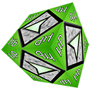

<!DOCTYPE html>
<html>
<head>
<meta http-equiv="content-type" content="text/html; charset=utf-8">
<link href="css/up.skin.default/up.skin.default.css" rel="stylesheet" type="text/css" />

</head>
<body>

<h1>µPlayer 0.1.0 beta</h1>

<b>What is µPlayer?</b>  

µPlayer si dynamic media library written in JavaScript based on jplayer 
(<a href="http://jplayer.org">http://jplayer.org</a>), with many modifications and enhancements allowing 
comfortable controling of µPlayer. µPlayer main core script is licensed 
under MIT license (free and open source).  

<b>Homepage:</b> 

<h2><a href="http://uplayer.org">http://uplayer.org</a></h2>

<b>About Current release: 0.1.0 beta</b>  

<b>µPlayer is now in heavy develope state, so please keep patience on bugs and 
gliches. If you found glich you can help us report or improve this project.</b>   

<b>Features</b> 

<ul>
<li>multi platform compatibility of µPlayer</li> 
<li>multiple instances of µPlayer HTML and FLASH solutions supported</li>
<li>quality switcher included</li>
<li>RTMP live stream support ( Flash Solution )</li>
<li>multiple size of video screen in µPlayer ( 100p 150p 200p 250p 300p )</li>
<li>multiple size of audio in µPlayer</li> 
<li>custom skins and many colors variation</li> 
<li>TvNoise Canvas Effect included</li>
<li>status texts on screen or in progress bar</li>
<li>on screen volume bar with mouse scroll regulation</li>
<li>popup volume regulator</li>
<li>play or pause when click on video screen</li>
<li>enter or leave fullscreen when double click on screen</li>
<li>close all popup windows when is clicked outside player</li>
<li>Android compatible solutions</li>
<li>added freezeMode ( controlls lock ) and simulationMode</li>
<li>debug mode ( show main variables in screen )</li>
<li>detection of enterpage or leavepage</li>
<li>show or hide playlist switch</li>
<li>show or hide screen of µPlayer</li>
<li>recognizion clrl or shift or alt key combinations</li>
<li>play and loading icons</li> 
<li>option for enable or disable pausing other players</li> 
<li>a lot of other enhancements and extensions...</li>
</ul>

<b>Example of µPlayer</b>  

{{{new uPlayerPlaylist({
uPlayer: "#jquery_uPlayer_0",
cssSelectorAncestor: "#uP_container_0" 
},[{ 
title: "Core Song",
artist: "Keygen Music",
mp3: "http://uplayer.org/uplayer/media/core-goldwave5.12kg.mp3"
}],{ 
playlistOptions: {
enableRemoveControls: true,
showPlayList: true
},
swfPath: "http://uplayer.org/uplayer/swf/player.swf",
solution: "html, flash",
useStateClassSkin: true,
useVisualizations: true,
visualizerSolution: "html, xhr, flash",
buttons: ["previous","play","stop","next","repeat","visualization-switch","fullscreen"], 
playerSkin: "uP-dark-green",
supplied: "mp3, oga, wav, m4v, m4v_720p, m4v_360p, m4v_180p",})}}}

  

<b>EXAMPLES (external media):</b>  

<a href="html-extmedia/000.up_basic_noplaylist_100p.html">000.up_basic_noplaylist_100p.html</a> 
<a href="html-extmedia/001.up_responsive_autoloader_3x100p.html">001.up_responsive_autoloader_3x100p.html</a> 
<a href="html-extmedia/002.up_dark_vs_silver_2x250p.html">002.up_dark_vs_silver_2x250p.html</a> 
<a href="html-extmedia/003.up_dark_qualitysw_extended_200p.html">003.up_dark_qualitysw_extended_200p.html</a> 
<a href="html-extmedia/004.up_dark_flash_only_150p.html">004.up_dark_flash_only_150p.html</a> 
<a href="html-extmedia/005.up_allskins_dark_6x100p.html">005.up_allskins_dark_6x100p.html</a> 
<a href="html-extmedia/006.up_allsize_dark_5x.html">006.up_allsize_dark_5x.html</a> 
<a href="html-extmedia/007.up_audio_only_dark_5x.html">007.up_audio_only_dark_5x.html</a> 
<a href="html-extmedia/008.up_allskins_silver_6x150p.html">008.up_allskins_silver_6x150p.html</a> 
<a href="html-extmedia/009.up_no_solution_200p.html">009.up_no_solution_200p.html</a> 
<a href="html-extmedia/010.up_dark_visual_250p_html.html">010.up_dark_visual_250p_html.html</a> 
<a href="html-extmedia/011.up_visual_XHRonly_150p.html">011.up_visual_XHRonly_150p.html</a> 
<a href="html-extmedia/012.up_dark_visual_flashonly_300p_html.html">012.up_dark_visual_flashonly_300p_html.html</a> 
<a href="html-extmedia/013.up_RTMP_live_flash_only_300p.html">013.up_RTMP_live_flash_only_300p.html</a>  

<b>Donate:</b>  
<form action="https://www.paypal.com/cgi-bin/webscr" method="post" target="_top">
<input type="hidden" name="cmd" value="_s-xclick">
<input type="hidden" name="hosted_button_id" value="A43BSQTQ9GW92">
<input type="image" src="https://www.paypalobjects.com/en_US/i/btn/btn_donateCC_LG.gif" border="0" name="submit" alt="PayPal - The safer, easier way to pay online!">

</form>
  

<b>Screenshots of uPlayer</b>  

µPlayer as audio player:  

  

µPlayer with initial tvnoise:  

  

µPlayer silver-white skin:  

  

<b>Screenshots of visualizations</b>  

  

<b>License</b>

<ul>
<li>µPlayer core script is licensed under MIT.</li>
<li>µPlayer visualizations is licensed under CC (for NOW) </li>
<li>Revolt Flash visualizations is licensed under CC <a href="http://creativecommons.org/licenses/by-sa/2.5/">[Creative Commons 2.5]</a> <a href="http://www.anttikupila.com/flash/revolt-actionscript-3-based-spectrum-analyzer-source-released/">author site</a></li>
</ul>                                                                  

<b>Author</b>  

Dr.NCX.Cortex (CrazyLabz)

<a href="http://uplayer.org">http://uplayer.org</a>  

</body>
</html>
